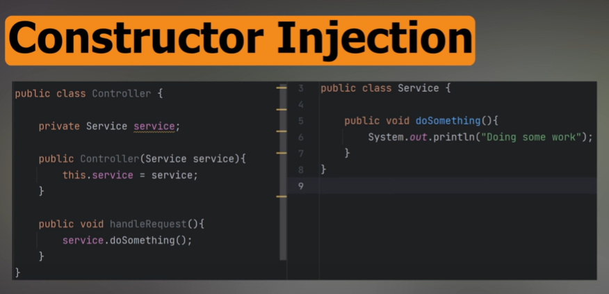
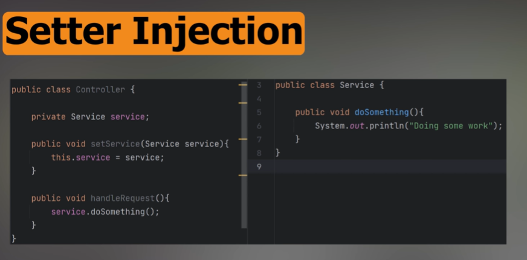
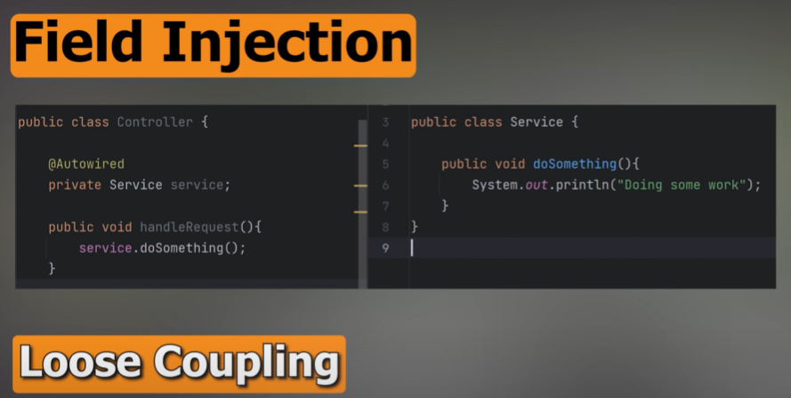

# IOC [Inversion Of Control] DI [Dependency Injection]
1. IOC stands for Inversion of Control. It is a fundamental concept in the Spring framework that allows for decoupling of components and promotes loose coupling between objects.
2. IOC internally used DI
3. the IOC container is responsible for managing the lifecycle of beans and injecting dependencies into them. 
`
IOC is achieved through various mechanisms in Spring, including:

Constructor Injection: Dependencies are injected into the constructor of a bean.
Setter Injection: Dependencies are injected using setter methods.
Field Injection: Dependencies are injected directly into private fields.
`
 ### Both IOC and DI are similar in functionality but IOC is [Principle] and DI is [Design Pattern] ,to achive IOC we use DI
 
 
 